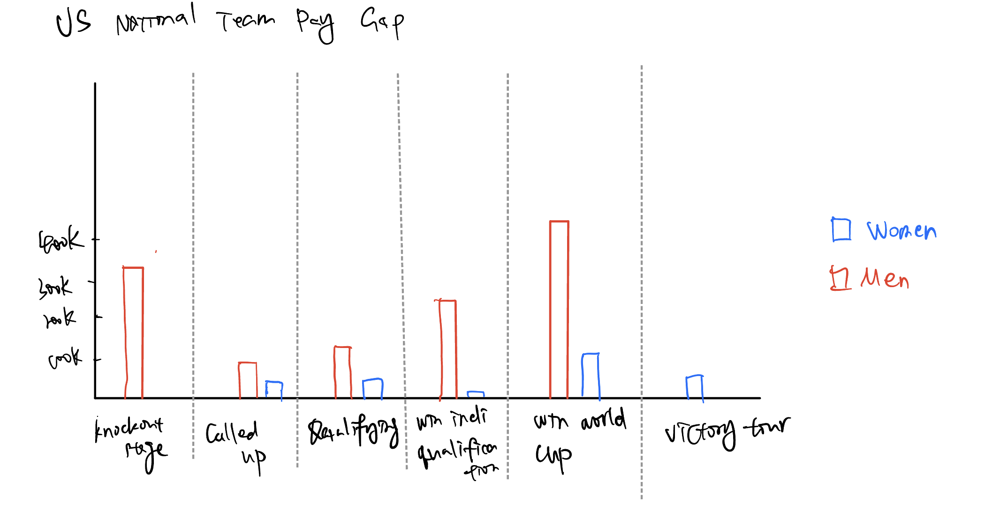

# Assignment 3 & 4
# Step 1: Find a data visualization
Original Data Visualization: The Gender Pay Gap in US World Cup Bonuses

URL: https://www.theguardian.com/football/ng-interactive/2019/jun/28/revealed-the-731003-gender-pay-gap-in-us-world-cup-bonuses

Cited from _The Guardian_ (from US Soccer)

I chose this visualization initially because I am a big soccer fan and the World Cup is a high-profile event that garners significant international attention. It combines my passion for the sport with an advocacy for gender equality, bringing attention to an issue that contemporary people care about deeply. Highlighting the gender pay gap could spark important conversations among fellow fans and beyond.

# Step 2: Critique the data visualization

# Step 3: sketch out a solution

# Step 4: Test the solution

# Step 5: Build my solution

<noscript></noscript><object class='tableauViz'  style='display:none;'><param name='host_url' value='https%3A%2F%2Fpublic.tableau.com%2F' /> <param name='embed_code_version' value='3' /> <param name='site_root' value='' /><param name='name' value='Assignment34_17072850284710&#47;Dashboard1' /><param name='tabs' value='no' /><param name='toolbar' value='yes' /><param name='static_image' value='https:&#47;&#47;public.tableau.com&#47;static&#47;images&#47;As&#47;Assignment34_17072850284710&#47;Dashboard1&#47;1.png' /> <param name='animate_transition' value='yes' /><param name='display_static_image' value='yes' /><param name='display_spinner' value='yes' /><param name='display_overlay' value='yes' /><param name='display_count' value='yes' /><param name='language' value='en-US' /><param name='filter' value='publish=yes' /></object>

Here is the link for me to learn create waterfall chart

URL: https://zhuanlan.zhihu.com/p/265807830

[Take me back to the home page!](README.md)
