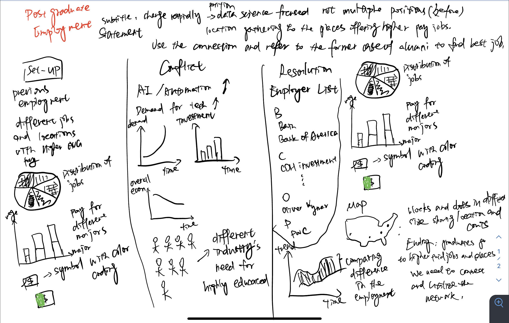

# Final Project

Here's my final project page. Check it out!

# Part I

Outline

Setup: In the previous time, locations and employment positions for the post-graduates were diversified, and the employment rate was also high.

Conflict: Affected by the epidemic and other factors, society has entered a period of economic recession, with overall employment opportunities reduced, unemployment rising, and wage growth slowing and stagnating, or even declining. At the same time, the development of automation and especially artificial intelligence has increased the demand for highly skilled and highly educated labor.

Resolution: Recent graduates are more likely to find jobs in metropolitan areas with higher wages, more opportunities, and high-paying positions.

This final project aims to explore the evolving landscape of post-graduate employment over recent years, highlighting the impact of economic recessions and technological advancements (TBD) on job opportunities, wage growth, and the distribution of employment across various regions and sectors. By visualizing data on employment positions, locations, and overall salary trends, I seek to uncover how recent graduates navigate the shifting job market, with a particular focus on the role of metropolitan areas as hubs of higher-paying jobs and more substantial opportunities. In short, to give myself and my classmates some quick suggestions for job searching in the future.

At the very beginning, we will have some plots showing job-seeking and the outcome for Heinz graduates. The first part would be the "Background and Context", including Pre-Pandemic Employment Landscape: Outline the state of post-graduate employment before the economic downturn, highlighting diversity in job positions and locations, as well as the overall high employment rate. Mainly use bar/pie graph and sometimes might use some econ like one dollar to do color coding represents the money earned.

The second part might show some changes over the past few years, such as Technological Developments: Examine the role of automation and artificial intelligence in reshaping the demand for labor, emphasizing the increasing need for highly skilled and educated workers. Economic Recession or the increasing desire for earning money among people. Typically illustrated with the line and bar graph.

The third part is the current situation of graduate employment: Employment Trends Over Time: Present a visualization of how post-graduate employment positions and locations have changed over time. Geographical Distribution of Jobs: Explore the shift with the interactive map in employment opportunities towards metropolitan areas, highlighting disparities in wage levels and job availability. The map would also involve the first part data to make a comparison. Other graphs would be consistent with the first part. And there will be a list of employers to show the most likely hired employers and alumni network.

Ending with some critical observations and call-to-action.

Initial Sketches

Data

Heinz College publishes annual reports detailing the employment outcomes of each program's graduates, including job positions, locations, and starting salaries. I download most copies concerning MSPPM, MISM, MSISPM and reorganize them with Excel into several columns including Employer, Job Title, City and State/Country as well as the wage and the sector belongs to.

For sector-specific analysis, databases and reports published by industry associations or trade groups can be utilized. These sources often contain detailed information on employment trends, demand for specific skills, and wage levels within industries affected by technological advancements and economic shifts. Here, for instance, I use the data cited from ourworldindata.org to acquire the development and trends of the AI industry.

Bar charts are ideal for comparing the differences in quantities between different categories, such as the number of jobs obtained by graduates from different majors or the average salary levels across different regions. Create a bar chart that can visually show which majors or what skills might offer more employment opportunities and also highlight areas that offer higher-paying jobs. Pie charts are suitable for showing the proportional relationships of parts to a whole, such as the distribution of jobs across different industries or the proportion of different types of employment positions (full-time, part-time, internships, etc.). Use a pie chart to show the proportion of graduates entering various industries, helping to identify the most popular industries. As for the map, creating a map marks the number of job opportunities in different areas, using colors or icon sizes to represent the quantity. This can show the geographic distribution of job opportunities at a glance. Also, it can provide interactive connections with readers.

Data Source:

Employment report: Heinz College official website: www.heinz.cmu.edu/

Search and download the data from the link: https://www.heinz.cmu.edu/search?q=employment-reports&client=heinz_frontend&output=xml_no_dtd&site=heinz-frontdoor&proxystylesheet=heinz_frontend&sort=date%3AD%3AL%3Ad1&start=30

The data copy link: https://drive.google.com/drive/folders/12zD0tWwooaOefxf1fRmDs3j9nSkgpnQY?usp=drive_link

AI development: https://ourworldindata.org/artificial-intelligence

AI index report: https://drive.google.com/drive/folders/1ma9WZJzKreS8f2It1rMy_KkkbX6XwDOK

Method and medium

Tableau: For complex data analysis and interactive visualizations, Tableau is a powerful tool, especially effective for dealing with maps and complex datasets.

# Part II
<!-- START SHORTHAND EMBED -->

      
      

  

    <img alt=" " class="sh-embed-img" src="data:image/jpeg;base64,/9j/4AAQSkZJRgABAQAAAQABAAD/2wCEAAgICAgJCAkKCgkNDgwODRMSEBASEx0VFhUWFR0sHCAcHCAcLCcvJiQmLydGNzExN0ZRREBEUWJYWGJ8dnyiotkBCAgICAkICQoKCQ0ODA4NExIQEBITHRUWFRYVHSwcIBwcIBwsJy8mJCYvJ0Y3MTE3RlFEQERRYlhYYnx2fKKi2f/CABEIAQcBXgMBIgACEQEDEQH/xAAyAAACAwEBAQAAAAAAAAAAAAADBAACBQYBBwEBAQEBAQEAAAAAAAAAAAAAAAECAwQF/9oADAMBAAIQAxAAAAD49avvm9kkelTnR87LSGHrPrFRSumyySlDoIBLUaLbC7nLv5t5z/HvnU0kxmrNZpWG8lqabBiUOIeVcsZu5gvGmqNYMbL2BF1BE7FvK3ZeCT6XmjhZ4X6Hy4QfkryN6DGzg3mvPH6Cc2aRmm8pY+QpuXYhrhx16HSyul5duLbfzDXy2XDGu+2LaGaopM9xZLq64BTyBPfPLWHASh4QPgw3nMS6fPPZVnKsA0PZ8/PPQdeOKHi1CsysauYTn2yRbbWsYbRKyuaqz/H0JaSr80g2iSWGX1jO1dMM1modAQytLV9jBp09RTA18es7Q1kUFna1jlo1nayet9WMguvlmjync8RrHM7me96fLn2OrZ5uYLEu46B3j3yDkQs0nuf086YFd7PTPJqyXPr63CIi+KZ7P35dlTLkvREDqk8omOY2vzQMawrN9PJ0RZ1Eoiv5SzVAXRhc+mtNZfFdnxnXjhtIn9PjuUJ5QiZdKad87HUngLml4nq8+ms1n6nPsNbfkvMs9ByxrK5zgsRvbUfQpOQFhBgxcTWFSQTFTJObqDli6+WYI91WzL8qrrGtbHDZtdVwxc66r53rYnXkicrHXgDZw2M69FpZwznW81mOJtDO1lO8PRq7OD0HLv0zXLaUufn7qNc7XR0yzTXkO++WAKE9MB8zIMiOsc34gnZqZHgLN3OFBZdjO1gmQ0v14lbX1S66bkrTRfefbmkuzR1jl1dzF7ecoGrgmi1xvxxLSzsrNX+fUjoPM76G3OsyzSy/TrcrNqb0xKBPRVPUb5gzF/bLhK0LCdAZ1XFdZizPlysYpCmbqJ6yji9Nk9OPQX894+mqzwEyHbvawih0+Cp1TSWFGeXS3+a0c7aA4nNMWVJBoCwzXyxcVgDkCIzqlFZU0qehnguSMWZ3jlAV56K3j9i2c+tcjzNdPeN22Y1y6so0Yq4QtItTVXVS7/gsUreaIhXVCi4lLZhMwaUgUyahqiVYCRe54UAqfSJcCHUzgwwlRGpbhIcZbxPw9paXKk0E7HzXrneSk6PWLV9k0lq5mmhAlWmnaUYh51NxVEzqixwmJ7PRvNcWDkDYA0qUBevoyykcbzXM8WuQFh/KyUaJr6wRR5VQNWFrOrlai2a6MVZq4CeIP016QOxAcOeVAmjChx2lEPQsI10LCHrzZzj/AGfpw1e+xznK6crMFrxMkj/kueDX8MgWzSzHtoUMyujSwFT1lsNVXWNrmkcvtw0Sat5edtuGsxp0UzrBY6BvOufv0ocdcUu4KXLptFlxJvmOdP0cM3q8g5s+5jI14FQTyehqcvnddmmD7tQxB7hzm/OjVMSzdqXFolTAW6xa55vO6lfeOUp2c3z5CyF+3DRf573Oujf5Y2Om3bKFLqeraWdk2MnS5dusvzJZdsmEUcvlGNwuOcbz/VQIfKmgHNsWH6KgyDCRTyGQhrYcIlN40Fkxb5upQW+ZDZ3muewmjUafoxjqIzCGdahuQZs6XTwQ8u3Ts8vea6TJUsgjOqqS69pWB3Epq38KWg4vPPT0vlCvs8PLS1Lgboi9i+gqPMmQt097ORnYeXPGLdnmazzS3R33z5E4x9vPcfpLLbOUxz6q6px42mTP29Sr894eiSns1DivLfy3p6deKTwXgzpY8NbMpcd8UqNGX6CEFNkJz8307MVrRWD1VqrY1/A8VEmoTIMvNi179fPi521n9eIWs0+sEZ6B/j6Ofa0EefXyjHk0oa1UIWVmiVlihrtqiz6YXB2Qo5gjlipHDHPqdjDjvevVObmiAGDShkLbILnPVaT1lITavbh6VEGsMHk3jJ8k1h/rZPL7RikxtNmTpyBeSW9JMdTeSZrj0iikkupsSDachiWkCachpEkPayAEJDPLIMKyGbkSWZFJO/npnSa5f//EAC8QAAMAAgICAgIBAgYCAwEAAAECAwQRABITIQUxFCJBIzIVM0JDUVIGECRTYXH/2gAIAQEAAQkA529Ef+tHW9IndgoJU63rX/pF7N75CrSSvWk8q8ZS7K4jk418gtabqkWZiVJB4pTYDc79ggCJiXZ9dRNFcrSNFqtIlkhjfmJ0EsrBbF7wdcXaqgPESYuyuzyfyEnjyB3150AcaLMofTBDC2QA6M/V0/W03IQ6woGwMVjlYJjWgBx4Iz6drs8pzDZAqGwN6ni0y0crwRoO4dsb41Lm0yUrf4+zzZY3h4gy8gkwXZEkXWZBTKiY5FEIYHf/AKGv5P19jHV6T8KEfDJjYV8nN4pPddGs6ToyUTRAB0qS6Kxd2Lts8JBPoa9dlGG9k8s5oQd+wEOtlMfagsi4iIJrUmqRjWQXjUdh1VsTLrjD+nS+S17aWccWlbSUF5leyHlmZSAKHsezhloVP1OL30ZrDFXFVMnI5aU/ICzLXrQdRj5150btymc7KyBCWR9jkSzo+wytPFH9SOZbFozTIejs+uYeeig/tnZC5LFyqPSTqw5hfKw6u1eRql5h158/NVpKnHI5v0OaOt6Dd2/cq6Jtdp8lkzg+MKD23oi1YsXV8HFwcz46pvmzbx0BChKUoAqKrEa1onegK1J2XmVCU6LLIrBAG53ZfCiFUyVIZpJOe+q8wMJdhgmdiWyGlUQtF5WKMuKuOHdaPe/aTTutINv0zwsADrGx61IGsM1x6tPo2e6SFGx/kLY1qAxQ7Cg9RWImw6djve1f68nGYglgOzHhJJ9lXMA3QgtPY4G9a1JWqfEovIwYKWx/k8mM/Gj5r/HNjd1vQ+gQOKVH6kMqBtCilkJILEsASPr2CGDH2GY0P1hjISi1xY2pc3V1X435OsshTR62M+xheMgGdWMW62DHlM3IZHT8aJFZBJywppjh5EPPxZK/jN8flXrleMcOSJBlsc2mEWjQrATDFmWcU/JRmN5YlS6milsZ1n3tnrOP9PlsuNKyPUv3LopoqFQFUr9jifGXeAueWnCRG+al7/Z2JOzxWIHGRhoss2n1YMGbZ4SAOI7qQynuNMTzGGPTQqMzBKBmnXT76nkk7kjTQdF60iEAZttbDrjf50gDsKWUQdEUmuFeDqrqBZwUUQx7yEqu94494ynPjJJK0WjIv2VdC3ZWKeTuApx8WLjKiCcyWJ/UMRi2kjIzI2JJMcViYx+67pkFpOr8JF6Bd4jX8hVG8r9i+8SUkkTV8gY5IPZ5lOpcpHEp4lNZ/HrVXM2OJmLsCsfjbEjyhfj8NYsRDN/DUIkF1pm/SUcOmkBx/jpUR+ZFGj2x1rp2J6HuP54fY3ys7J1bqoUqvoCevZx64Zx2mUuXdgBWF7QcPJ1+VyOthUUyLWVBR9lgoPOrEHSoWM3AX8lhc1nxsbJsi3mGlREbTYxzIdLOxwszJvTriN8SZ2jDYwskWoJhJs1WWqxSk7oUaT+JCjMcab5AETTGLq6irTKoHDnINVjFQQwYdR8ZGNaeFuTwcaeRYUTN+MChOlMXCYxZWmMCnlUUSWDDq7JzGUSDKOBXap01VSKVcu3ytRIfokFtdQTbD8aB5SxcZnJDTd1Uqgs7wMg7DIkLOxC9WVt2BZEHkHMS2G6TWq5/x2OwD4r+Zx0mUwsOMV/IZvlBSedXuirs64vxiXhZ58MDOzyPGLIzw7zZlooTknxbfuZvDEZtDHf/AMYyXglYM65HxtlnlznlJZVMqYeRSbvTKn+OXFaRF8qu0Xq0LGju1fDtVKsCFbR54+tFIo3twz8r+zBmZR1baFGJmEAlB4USgYPkoZsWrmSy3REeeNPxluuPj09sXEwARwT1sc6Or9i2f2fszKzh5/eKhOqK7fKzntSTfIqA2LIY2RYAGOPBfB275kjKhUNMo1AbHL+O+NZFedJ/A5hRWRpZXyGCU/IgYYPya7Br8Tl45YYeT8mMyNimSYrEFdrjZb4ylOZ1sfIoHhCU5urFqHrocx8q0HcpSMsj5DJRMvK+aauC0ILm0yEyE6WrlfH1w0jloaNTsjvKBtGQut4Rycqo2EdYMwq6ZUmmwMyYiIdudQev6MxpBpsPDvZ4JOBvqGPMD5CHbxmSLbJd6oPAcdu7xwqGoVhQKkwTz8lCpZOL8jJ9bY3XfpsnKZ3duOaiIseNbUyEqq9qzFXzvyokHdPlqAFJlc2/gDK7OXtsgroK5OCzOyQ5Gl8S37ta/fpN6ZHwUm/fHez/AC2HsMc4tezmlULqT1JyMrHKK3HdakOORSZLUNbPFnPjRfXvWNHKZaGEMj47JpNq3qMcrMTZbsaogCvkpkpBRGT5Ews3ZPkIhe5rj5WGrbpKkQiiSm8Mic1Sko76liTlLNwhSEDPJCUmjsnccqS3UBJwoTMjmHivVlLjxq8wrg4sdDYK/wBLVOXZJI6SZo1KnrxK2l1LFyzg9qll0VLrBa9dUOP0AZnsq9CBYq3s9GoiD+57OGVi3lZQCXjltOqMHycq+TfyNz8mzlAWX5VsfEn2U/LIoP7ZzEZNlHFLL74izb0xXHs+iEpAxAHbxGyq6kTpioZ5E4fI2+PJij/I/I2zal3SHkcO5rKjrJh2x2VbGatMgsNgiS3n4+SwzkMNzb4nIIXVLtYMyti+DEfDZZo8SlfalztVHFyniECtKT3k7kYXxa+JH6r8f0AUtEKFLafucpWPL1LScdZsrMe5plQmCk+JCmRoSGTAYxkNOgtReoxcfHIUCeeZz7BMedHl2FWtiF5pWhzPjnxXVS7wShXfK4R2Al7Y9oFOt55diNMopsA9TkoV68dnKMyTXLPmo9JhNj0qw7dtNG1MZgVOG6vF5UFsVp+9JJw7JQ5TGqJpl6ew49rpQ0H/AGB0HVa9lMN1mKElSACT8fGt0cTvia8fp9Ab5mRvWjrzMxiSLd4YpqKkCfT9dn46GQgAWd2ebaicahpJSeVfWlHGm50BzN0MZueChJCr+FKMdz5DF8YmVGVhGzSbmfNsM9Eb4/K2vianyFIxqVizhqEu4nWrxC6pSqlCQ5H31YgAnj6bTbyLbfQ5L5K02mxH+JY1HLGU8XJyU3NPmPhhjSxaKiYWYbouPO8s6QyFsCVlr+njs7FtcicjKpSMZZfVGMyiEkGhclXZ+wm/VSO35FfacB8h/VcXJomkLJWu+vT4rMnKihuZvyF0uDB/jsulmcM+YzyRgohQugWkvGscvcOTxY0xrKIYD2/HQFclwumHIABd8cKNuQ2YUkWCRq1e1Qscwzu0ilb6hSymXydyRvl8ucQSefIZxybFtK7gso5Sjs3PIRz87IGyvGzEcKzCtg6+1pVUH7FstQfatRK2LAY+KmRQpvK+MwKxT8cYfyuZ8c7Lr5b5yObjY6oIZXz2BWjGeemPmqXm2V8Vk+YAmvx2bBQVEr1kT0ev7sxDDGfSkFZsHOlhHbsDzwzAp5GkGmEJYLTylyZVIRWJWiNVTyl/MJAHGy3iHHkjnzvB1ocbwpA0pRgPyDVDi2Z8sFiaRin6mzsW7ahfxem5l5HZVWb9mAY9p1qqlQ/7bZnL5LBdA0s++wLZT10H5Wq7b07h23yWPSre+WkiD0zTPv0UXYHGoOmlSo0fa+HJoE7Uj8ZJ27VNfhcTxBhw4mdBdTZ65MVIpiDRY7D1R6uBLqCQ68yKDr6eeQGV0YZjzoUZpjuzf3z8wr03SStUleIrRIqoKmgc8Dguvakth2Lcw8RbMEdrYJl7RpJ2RQUdUAY6x5seja35dkt0Tv13vxlf2DVO9s9HQAmm6/8AY2ooILOhZCzGSMV+71ZCykttjxVUA74B+2wJoX7EGaCUgGZT4+rh8sBX7q9XVUVAQ6zJ9UbsN9MilbFS47sxGuJkLJzsNmBNFqXsgG9LkBgAHzghYOFiX6ey2a0XG+PlSspoE3MBlVrSk6dUfDwUCVi3PwBMM9lUaRG4AzKA3DNgRvg8Td9h0IG9Ywdgp4ApTW2j1JKq3V1OzJTL13QKnbXNDuX4yB2Qngb75RFoNHmz746q4IPJldHuGospqEFd0q3YmfUDfGRtF+vt3TfFoqAEcvWjkNrb8Z3I0FI/5GgpHCpdRpj1QEc9/W5eInW2CTQFeGAoGLgYUWI/TMx57DJSCTTXunx70qByeOFn1k+RIu2gVgBVF8IJkVZWaa07Kz5ekOgWdQoXQG19cZDvk5U16ErXm3oQzC/6njv9749incBYHaryTMwO+Ch8xTlKFSgHAfvgDH64SRytOi753JToWFCaHS1H7k7clvrizoQA4o1NkaJAULobDAITHTfsp8ZRdL4SX6rykTMKWBGzzYT0UYqxGuVxkkJr07AK7FqL9MON6305kT0oJXxzLelQ2B2WfICIdGbfvvZYrXuraV2L8/8AktrY8bbIdfxCdED8as123JKKeuqwY69CTO+lKYPUKSzN698oBsjkm6Aa4hAAAAANC+nUMR2Hf39q6gf3M4/5bq4YHn2CNKASFHDAu5dR4kSi6CMpc7W5/qFRwY3Y7YhOtPRqZKVKHIkAqFQCDsnjac75PCPvyFsWRA9pjQ2iFcpx3KdeqgbPHTFEyQwTSue1QzKPcvKwPVvG3Qvz/jaVMpSl045K66c9iaUXn5SmDDtN6FCGLOzdeSjjz7t5VXq5PPJ3HsQH7qeEcfj/AN3DRF+zNwwBBair9laK/wBEoGHvjMgOgJqjjg0N+/Mm9dt8bKK9V2X76Owwb3oIu+x4P54Tr+e+t6LJjNAU8nX75LaOGDXfb9Cz5c16hQuTVSdM91Wu1F7yoOon0UgleUlZg5PBj7+uTx/1G+XSYxm0RuqMeMrMT7ooDDXKVtOTGXI+ZZnycTfVeDiklrcQkg8j5fIdiP8AeON9jjt64SO4HDsg8xyQDy2zReT33Xg9g898xvtuVJ6tw/XEY9Bw/Z4n9rcQ8U8B/U8J4hsb9SHJ7ggjh44Pbe4NkHIcPzWtngoxPUBqANo8jllxKPLt+oILFS299uUVWRt8mlD6QVkwsAQ7ULnsNjlLobTlxfSrwcowklH4CdDiE8xtlwNVBUbPHceuFh3HADxNjfHVmIICK4IJHY/QIm//AFTsnY6Ykqdc03/A2FHCDxfQPFPA3EbhPs8Lco2hvgII2DzMs0Zs6idA4BHB7BHDEigJD/HnT/tCX7KOSmKg92rGUCXclx9CZp+rdlT0vkRaup9txnmW2ZosXbQlTExxXZnsAD0Cvr1SE3QMyCk/Q6LRN/UKN2BXlXY+mXSn/aKrv/I8SBVPh6DZ/oCKf/VWWofpNI1Zh+qYtzOgMqYmR10ZRhZS4pJpKP8AZ8Y36h4gVY+LxMfqAk38xEf1Zug6j/QxT3tECP3/AKYCMjgy/UAAJNFct6dZONPMdAABKSijMOrVXyh+puKH3yZWllUKtWXYHPmPki7LjzJLNr9jpf8AcDBk8W/DPfs+OP8A2HilpgzNFnLFh4T/ACFnvXEmzDqeeED7AmN721GHoUWoPryKlT9MY14JX974I2/48Vv4XFlV3KlYyE11xgTSfogEaPM2LpooDHJP+2MfI19fj5PPBb/nxP8Ay5lX6D+Cn/cxb/7DDX+6cZPvyNOKkfvuCnXlZ8UfdDTF/hvNBd6cfinZ7Vz/AIuex5h8xhzYMi5PydrFhM7/APyT/I62nGb5IAs5XIps9rJVGJD1FoLsHIVsQnZcXgx6qqXgTot5UQ62LofS8WgI4tv4ALWI9qC2tngo+tdzWmv71tZPp1zskAjyYeTk1oF5AyRNDgZT9H/0wUgg8ymMGITj/I3ViOlcytR/mNWuyPL3qf8AUBdvY51ts7Us6nWtMebI4G/nfmb/ALjLso9F7FvZdyG2WcvGmlJbHwSpPHxZPtvOcZUI7UMwv1yOLhqNMzYfxQbYnPAwy5KwX4mV9dYP8FNgPK4+D+K17yofDYE99MhfgfjT7Cv8HhEEvIf+P4qFepb4bHmu6UfGxJe1ouDK7DTn4or7LL8Q2gVivxDn+8N8bJB/mnECDRcTgmgOKsG+188J6DJLKi/pS90X7L5GLv8AbinGbfWbthoCSr5XxWjuL2+NLbGMMjAJ9471mVOoB6N/bJEzGTTYoTKUlRg3nkE6bD8MgSCinDT7iKYR9fjSwfjbb1U/C4nspkU+ORD/AJ74AGy0/BjA+8dVwgfeM8vjvWkGdfp12vyOSoI2Pkcj+GHyEdAGo+TIcGatm5VF2efnZMiT3l/5HmD/AF5HzL0ILWll90VjeJSpB8sFkCAtcfLkEAJrl4oHYsmRj2HpyIa0WeJY+qxxSxPlVIIBoDwn75RAo9496wOlEXjYjsICmQgOklXPKr0lkHKcEMgkWH0+PRfpTTp9qMrX+j8o9thGzsn+HOZksPdRWgO+zXqfvjWQkdmZ5DQ7d13v8i1CqaVnya/3rZ8zIB0zJ8iwILtXJ+PYbIS+GGJ8HCQR9e/s86nW9KmQ4GiscmpbdH+OcMNOuC4+xH41G++L8TIaJSPx/Rj1mMVUI2Qk0GvMr47EhqD/AAxdlbrdV9zyKZidh2ZPkkRf1WPzOh+6D52R/wBpvnob0I2+YVvqafI6VuPm0cgsjXfsepORQjRbz+jtCWPGRm4YMRtSeHm96PD33vbswUEK2Q6EloNm612h+Yf5mcu2vTvk0cfsg6ltEeyffDofXO3JYFH134sMWbKiD/DvJQdnPxcQxXySjjyGuwTHJ9ENLv40WWKpUFlLQiD7kyvoKbUMB/mU+X0rgtPIewLAeiPbL40Ua4G2RvjNskLz+fYHpdklxrW9jgYqfXO/377sQfSlhr0SPsE+zveyPvhfX8K5/h3Pc+yx6kA80T/Hj9e1CqON9/5bY61XRH+HFPSqfii2iq/4Sw3w/EspJ7Pj1jol1mhOmUxJLaU5sh7PIVF2bqBCSr3auXfF31RvMd6U4lLGg0TmRn/a1M3McgKKqwVWLzyV3ommafc0OPirT9r0M8Gcwswx0eA//vfR+1yKj9UZi29krM01oMi76gGbetKdg651LcC6/lUdh6BQgn1zYHriksfpkY/aa1/oKH/gIvsz4NsNcGOTokJjrvZImo4AoHoBQ2gAyqfR480P0L4gY60fjx22B+EmlB49C/OoVdrXy00R5Nb5MIrKeWqso6ScqOKg8hkETU0GbUs6jrLLQqFSGPi9G7PwLoks/fXpWJ0NE/8A8VVGvQ1rnYjg9a0PE5XsXVyuwTvbfaBg44qdVFCmRRQnO5YgtwJJwCqGCtshxCbfTLh3OuvBgZIX2j45n27z3p1K8o06MPZrRTpjOhOuAsffPNoe1GT9kcOUuvfDlqVA0uSGHvishBIP68kFX9mLFdnrxSOKiNslp+QHvPjZbKrBxgwn0Z3WxhNdl9irhnfFmijaLtQDoms1XSEH62oYL9qrk+9hzwDf2Nf8jR19LT/ld7P0GIPrgdh9Fmc65oka6qFH3wu31sU0NahkOr75O8NAitMiLelul12ZtwrjNvaNPE31K+GXQjQj0UsvPMSCOdyTzqfftyNEHhdNeuCqHe+edV+iLb5f45DsyI+N6/3s+JEI2ueJz712KIEFBGPi8jUtUu3RDHBYqtLMIq6APEdJrped2PoptSCAydwduOrbPsAt9Few2vADzZDn2ANgEsikfSzkD74iy2eUC6141Rde+I6L715gxA6JAE77PggDa8fHdPolG+wdMOFW55K612Unejxkce9fRLJxj3Y65+SQ7IeJdiSDzJswQAcTJZdjf5TbYgPlEBRtc4gejpn30KT/AEPeeVnQTSTWuYjoUWe+YyClFUrjfHYiaYokccEm1LthLrrNX8hJA9KAAOhLbPGDD6K/roKv66G+Fjse+6MOIO30iScsFPPxmA03KYbfaHGlVWVGmmImgzpTGmisUQfisT+4xIVG0aGLIT2Xmsn/AGWh+PRxvifGx+wW+NQAfrX40D2iWwqK3pQGHpxNR/AbHDnY5TFJGyHT9f64vjtMsBxl7AqePCDAejDp+6Oftf2ALcx8509M1/lr0kZb3w65g4L5dOu44/x+HpFnbNAZZiYKdtUb8vDWhn4qZizC7K5kC21Xz1ckIO4HYbWbUYMT1UgheJjkNvcYq/s8R5oNSQ5lB6HPKtWUBIYpr9Vw5zx0A3WTMm5gUraZCvXEMi3eaZKR1OKSyM4ZGiJwc0LIihGGthdfz9+wDr6bjQBGuWTH0wRFkg9vycGUgIw/Fn6ArMt2LJaSS325lYXQeSQG99N0cIxVxRFaYrzqX2d//8QAKhEAAgIBAwQBAwQDAAAAAAAAAAECESEDEjEQMEFREyJhkRQgQEJScYH/2gAIAQMBAT8AErHFxq+nBuGuGIhFJWJclJPC7zbE6+5WDbGrsXgXpSFaSF2M9bGxbayYEUndWKlij42/AoviiKpNC7TbOSjVxAgl/YfNIjKmVGm5RwO48ZiRfjJVldEu1jnprL6MCfoV80bW2fRGOW2/QmmuMUR+rN5FZXayNyXizfTppoUjWlaSboUfaZGVOiSSyN3ki0Q5F27G0ick1SZFatWmmOWnKDvkUcNW2iWlD2ySrF2bU1gUUlxkghJ122M2x8jjDlY/0akcXuszWB3RGCu2iUEsnPRPuUUNInFU8deSjaUV366NHghWUndD7zpyq8okuBKVj/YklwUZ7dFFFD1IrmSNXWtVH8nxzrl/kWjqe0fHqeoihqL0fVfiu+4t+iWlfhH6f00b5/5MWrNEdWfpscta+GR+Zu3QrrPbslNIerH2SmnxJi1Jr+w9Vt8R/BFQ4WWOMIq3FEdZWltN8Ubhu+BJ1l9uhwi80fFD0PRj4Q9Fs+5lkHtTIxcVe4hulNtMUVFfwfig3wTUL5IvNVZHRzc2KKRRXcdkrqhqarJvmnyfJOqvpoxioKVZZbt/Zi1JVLjBCcpYFl0JWLttWPC/6TWV91Z//8QAKBEAAgIABQQCAQUAAAAAAAAAAAECEQMhMDFBEBJRYRMiIDJAUnGR/9oACAECAQE/ABsUk7rpuUIZKVuhsvLWSQ1fovMt3VDH5ro9OhIfdwZjLaq6Hbzs70htEnmh6S6WYf6iTfBxbJKy5WknmKnvkyS5LrVz6YT+wzLay0kfZvheymPLjLpemknydnKZRhKm2OXhokrQm9hKh2S2Hp0JWQTW6H8d7MUZqSrYbzTqmLEkRd51RbHJt+iQ2tNCO6XApT5zISzqjK8xUOTqkKTeXV6l9ERbT3/Cyyy9e+ifSQtZWo7CMhfg3erZZfRQl/FmHhU7Z3xvZf4fJDwzvh5kOUPZ9a100vIsSuWfN6O2PhDw4seHHyhRw63H8ayVjrUUWxYb8EYNcI7IvgWGkt2Sc93sJybpNjwnv3HY2dpVbj9aik0fJLyLFlyfKl02JK2iUlJ1RKoxSaG2/wBj3yrcg5+BrLceLxFDbeuqsTg+Dsi+Dsjd10xZNyavJFZIcFcfZKKRstVMW6/oi8n6Z//EADcQAAICAQMDAwIFAgUFAAMAAAERAAIhEjFBA1FhECJxgZETIDKhwUJScpKx0eEjMENigqLC8f/aAAgBAQAKPwD8gD5JQmO/qEMnKl6sAKtk/maqEuosyHUzp0tQ1rXojBRO/lQk2q0tg8Zh8ufWALBI3PzMahXUdgINVKirBHI3hNKPT8ngwq1ffYe4gQWNajG6gf8AazCVVnhECA1BiigK3ytoR08gafHEPTAGSkcnMsuLkIGC170HuwEIVUoxMYlrXpYJ2fG819QEkHfBO5i/DAw9zCq4IEIuMiy9oj71PPYwmzZJmqyBHglwkb5izj4/KHewGkncuabI/g0BeoxEEIw1vUogiYMyLI1/l+uNpqvaqNbDAAMHxLbOA2exhNi3Q/6yytUCwa45ENqA41ANCChsRqKgsbXLbLJMyDtD+HW2HXOYTS1mt5uXjb0ZeylWQTRDYxMJgizKltD2OeXsZtQCoeApXXbJK3UUyQgTAahYGN4iQiDGSzEKdNAdzFZ7jMRwfBUXUJ2AhRmSEfp+TEKZyMW2X2MsehYfoMUsOoTmzYM/Bv07HRUj2u0rdcEMQm1jgATLUOBC0m9p7wBmD3BuwcrU2D3C8ZEro0M2qXvhw3DflTXfWDXsvIlRXRkV5uJotUoyzBYNQLEkbmZoaDUCARQ8LGYK11ezUcqEvPzB/wDQKlMgjFtLPyZcf2mw1APzO7IChDOC5ZkDLhjrCAX6HVAbWqQbDZGYOD29GTgQW+DFUndMiX6nXJ3s3CfTfcniah3DA/eDII4MHbAUzNuHDL26lBqelhJFifh9WoritdJBlFrNvfUEGxwzFa494FULM5ENL1aYYY4MNUeJW1CELGg1KVtVL/qceBNVb1ZFeIh+LqqAXKa0f/XO86nQvbjBB+JQnP4lRZVFuNnLAWB0qVPTvkFcCUY0ipDxwiVMA7kMJwK12Ya15IxaX/DwQNziH9L25hwdpUUTyeBKWYYR8wjsIPQhhh8iEEM1I9VjcQF98maATmw4EHU6YK11OxmrALalvoHNKJqbEFi3mGqzVjeWAsDosRFUwi7/AFphGGrAIMsQcmof3Uv0bYIsAUiOVs5Xo9QWN726m5fD5EtYBo08FTaVPODkyt7Iqx3lkM6Rn2jJcuNViRcZHkbQ3qAal8wWBBdLf0nviYqM5RAnU1fq6diWTXzLCvAwTgdhCT0wTQgaggfM9+psTC1rWvjaWLP68YWCxNVbZBrLg4fO4eFLVtqIBJ1fd7GAlbCrahtUN0GIAE/dxKsMGygPYSwNhmxAIE/8i2fycHxPxOkDsQ9MYG79DMEOAF88R2eAt4TfqUKXBE0EMHjaabd5XqWuB7rAEgjYiG1a7AwkA4Dm28HDAYMNSKqo34lOoDZE0WoeLVgsDkGpsHwke0pfp2Ptuc1BbRmm/U6h+GNxmdMa6vUSlYibC3uAbWY7A54sIKXr/XY7+McQW6Vg7UNSUThgcEQ21AaSNwZ/1OiCb1IzZ7kd4Ea5G1hwXGu8NTXFiDsZUaSS9zYzHUuqEBJyzsdOkkQ214DsN6lbQW6dTbAAFvrCBaqLHaOup1O7xFVbdzDgfJlSTjAmp2yWciabipAxNJ05e0/D6NbX16cFgnAi6VidHSqggObkwUKYA/iG/u4wYw/0HJC7y9rMtlVFQIwavSMlQVQ0kjGHsZW97UdQNpUFn0vXqdGr6nTsMCDUDg7D5zK2qbOxCTryDGQdjkH6TRfpl3FPZqq8hTqe42I1oW8ALeUq3cUJ9wEBVWRZ8y1DWuwP3bg6nQJIAK1YGDgfvCbgsZx3BEvUtgGzR+FNVbhkjImoh4AziCxA5eJVpEvAIhthWs+2Spi3NjqsR6ABZPOIAs4yUZW6rYmow+06iAZIGW9pZioII3EsrEvXX3RiMT2h4h0/ZiDsG9oQKp+IbFZeApYsK1gOOwJh9gO3GXmFkmu3eAmHQw0OOYa1sCal5Q8Stgdsw2oBpDCwPMqOo3YJWIM3wBAbgnMtbHICBnTsNY1gh6xvuIOkeaixNfo5pIGAiXMjaEasHz8y16dOpsLh2C2h6/RFmAd6y3tG1hqxwIBS9lth9s7ifh25CAqeyhGvIH9P3l9ZrqB8j7Y8y4uFq6dqnPwRB1On7f1WRqB8KV0Xsl039z5EKftgrRG9QsNxrkf8wkBEmDeCuWLNP5leoa71O6nUDA0sbGWFrgMDIxEN4xs5p7zABNogNnxBpOAe5ctnhLNoNLznH7Sv4e9BS2BLCrObHJcr+GMWqDpTmrk+RNzAjYb/AHNTLfgtIngcgSvuOQRg1M0HtxLr+5av3mRc5s+wgDEASIAQeOVB+JbeoqFBVJ1J0kvcCaKgbb5jE6t6hC2lpHgqV6drkWr07EoADbnInvbFtxv2hCDWUSB+00GtACfPiG/QFigf1V8qW/HBXs9ssOpYWF7eD8uCtNQXUAO55Jh0r2otsucpGVNg3ao2fadK2uoOm1iFVIz8TpitgacVDmmo2G+80iwxbYYKladSvO+tHxK2Q7Ymkt+3EGBLabkkjsIShNKBLJ3lAGmSIwzu1KAkiuSAJXJ2Y2lepfSfbUayB5Ihg/3ljYpEQqVqiDt2lDxgYmQgILnY2FsCWvqBwcguY/EJ9LC2+MuMEEggcD47Q2eSV+mA2xWzt9A3ALWYDIdfI3lLWPu1CzBBxBQ1ACEHTrpT3MYJ/So62D3muqZ07qXtVe0Ebn4EochipO3yMCC1QBpAz/rCAya1GfG42EAP9TD52ZhAeAcFRASqIqLLBwXmajUIEk4HZDeEkgPWj9hH0wRbS8AjtA5cgEgZ2+0IqiyYACx8yxuSjDpBw+T4jutRIziaWcyhpUIe1h8zp2BxWyGCIrEYqTwczRqIGnNj8kQXYcOOxIl9I7yvUC4CgNa7AYR+stXvhwoHbSZcoOamT7exhKCMPtyDwJqJqRXHFoPxbU09MeLf+zlhQe3VkF7aT5ljufYBYhfxOkT06BfhnKPgwjkEbwF8hyoA4IhGPgxMFMktQWqAd2o9JyCMmvzDYenuAOTUI5lbNaq8g/EOoZFRz3iIZa/YwK1ckkEftLgEsjgfCnuWZkxB78zVYEYlq2j61wnb94rJAATYK1e4iFq7OLIz45ljatvkQ75fMFqjYHJn8z3MvMTh/iJHfYwEDYqEXNsdlFQwDUEVZszqG4yFvUiGx1D8REWDM0CyKPYdpit62FTgHjeW6lhlbtQCwOTDqGyiseRgfYTc5EBBIaqJqqKqx3EAA/QvtMHcbuUpQlMzT07jUPKxNRThPUtVEtgS16o1sC9J855gxgEHd+eDK66hjLP8wAVCAHMGT6ZUZ+fPMA3AzKCuok2B3gJB9olTmAkAlOIaVDW2rC4UGAseI+zlc7qOwGzxCV84EAfeEkb6djKhgPViG2kEoZAUtqWTUEpTVTYjZiEWraxIMHUpa6ZViD4IgNzUWJ/ts9viGzOLlkBbqG1bWWkZ2zkS3TstNkwTDY+S4bYeERD94agIkgZEvW1v0vfxAAw7Fv7TPGNzAD+5grtgB7QOoA325mk7HD+yivpOe6gFwSicmDTqBymxBS1iDbGCgYPgRswmv+kOQ8QHfeECx4mQMxA7xKFCqxkmI242xCPgQ1r49PrtD5lACBkDKirtDQcLFob282zYw9OylL0lLMHhj9ovAgF2VfTuBtlgw1sTn5gouF3jyfdXn4lq86j7SD2amkEkshQrAI3Bm+z7+JsPfU8juDESWGBgRP8AqwKmC1SAsnnefaELb5EpXSlZslQBnM9rL+saxPdETgT9zP3MP3MVdUcAAaX2mRv6e7iHxCzheIA7bI7mYODG+ITh5EBskpapJ4/4cNekO+9j2+I14RECyuTM8A12fkwVsskncwqIsi2EzATV1ZPDcJAywXDVnJsW4Dq3Cc6hvY5Z1KozCTYDSTVrzB1DoAqQqj6iZBRPiZ2z3mKnEbwCRAu4hqAQjHGN1AxGFDmFqH27Kcw/Qr0P6niOo/mEE747RExTBagWnJ2BhJrgxDYH0yBm0BPJnMJQZHYQXP8AdMTOz4h6htU/q7eFDlCPk2rhS6a92YcnBIQhqNsciHLBqnuJVpRoHUh/qoAuLNkWnuA3EJYIBIlixnBhwJuID2JxtNIBZrtM2O87QEegEG03M59d7KKu5hIBMwPTA45zMAhREx8QJmILIE++JyH8TEGQ3GDGSMnzPBHeecQpbrJhLPMH6f0tyoqMAE5lQQMmsJse6EAQwSmTvCLjpnSe5lvhb+h71gtx/wD3zNq/YiJbv5gBL4mRbb6+mD6bACZM2nPqw5womYqck9/TecJCf0w6fAUZMwasgZjm80+AGZYVTjtiFCHPjENj3Es8IEQoY8S2Vt2liRufmKveC1uoQRjYRBk6T2MO5G0VuxH8zFt4AgvEve3UsDYXyH4m5cDWT+bH/ZHt2C9czj1tXrAadAOCHz6CpA3lf7rrsIw8zChsHknMPebLfaaTknzH9/Q661LE2RH1hQ2Bn9I3gJRdU3Lfrx3Xrt1P/wBRPcoRXz6cTic+uNP5efTj05H5Sue0wj6mFft6b2ZhwYNIINvLMIf1xtA8vgenBm5Ji9iMzWo9MkEzj0ObP14nE4/IdoVOYYvy8j/stKFEMP0zX+RM3s94B/xmDRUk2DntOB7djB94CFFwMxlwl+ZknvFevLPqwLLf8hOZcy/3l8vD2UvLiWB1DzC3jELQWPMv9pZaey5l5aWYlofvDhYhHoMUJgWIMTapMqZWAKrgeM/EBMHMrzxARSzsQOYIPvBgtuUH/wBSn+eUfA1yrJ/uMp/mMp/mM6Zrv+qdEfWdH7idPbuZSV+8EqoIDDXEzMB+hs7QfcSolFzKykopWUnTD3xxOmviU/yytT/glf8AJB/kmfFJ/wDj/wAzVYcVpLgjvUfwTBSp3W5jnUUIxyQJ1APBJnUFfvOpYcJ1hr4IJl7FZJtLEvYyvyTBHBDDLS33lh9TDDYcnTtPknEHriG43CDhHzUzT8MfzCfqfUkwiOKEfAlj85g+UJbV8y33MsanY+6Kyw64lKn4Uqu9cmC06l/KH8udaz73AH7CWt4yVDVeRWVoBsNY/wBBPsDYzqI8k1rOre2NusC19Jf/ADg/xLgnYG4Ala/N43/ap1n5SjA72hsd3qAlKDyQZQnzUTpissfOkmWJHb2xfJgcr9TKk+LOW8rAlz3Gp/zD9oR5ZMH/ANASgr/grKH5FZ07jyKzo/ClK9kAJnnMJ8P/AIlK1+8FfF1KH6CdH7f7CdMzpmAfE+9BB8wHPaAM7qF9wFL+DCNv1Wcrq8kEKVr8ATqX+stUnCC9Ky5UMP0Mu/NnDUDYAw28mKWJhsuRkw6hwQBLV+BMA/1VzAB9P5gXlMfaVJ7Alyv1sHATKmAfEXwAJYwwKAfOIpUggpgSrwj3AnP6TNjxiY/tUNrfWX+lvQD1KAXwIeNzGFnvD4MMO2ylgJYeZYyyG7OIX8kCdP4Ac6tvLUu/JcH0lhDbvDXHCjPnM6Zx/YIKfFR/EJ+YD9TB6V8j8mIDASNyIpTfBUBGdxKHjafb8mkOG5faIQErvKwTUYAIIATKv7wHySf5hAIKtHjeE27LaDyVMfC9ADC/VR+hBloTC4vELgzt+RxCOpMNUYURz6DneUb4gCMtYsHG0RW5MJyHmWBOTYQnsTMPcxrcDvDWo7wfHBg3UC1KVoPvY/EfYdp9IYoAPj0x+UR/EIPoRH6KD44MON68j8j9A4oITOYZie4Qr0eYiR2mQTGbcxVqZa3UMd2TWvAgtbdRGAkwGL6ejHpUDyYIJWVsRviVr205ht4cXycSg8QMfSOBfMtXsYQuYa38bGF+mN94BDNo8xTMEEx6Ih4mILWMoHlyliidNYu5MKP/AJBzBWvJ2lQSNyd/tM995n7/AOsP5BB+QP0MJEMEoDzATAfguGvZn/aAidPqV/uasPmA9lmYMxz6CCZ9Uexm4mRViIJ5m5LmfOXKrwE4K13RxBSo4qAXABwBCPJqwZnvXP7Sv+LaIfDmIflegAUJ+YIhDaL0Zg33TP7xA8MRnz/x6P0MtP5Pp/tEQMiKIT5mTtMw5y4SfMwIanzNsFQVHoTNfUlKHgH/AJlbXG9g1EGjUiGojKmkfDEqf8JUHhzHj0JMFX3CgHlsShPhmUtyrGHbYbQCqZ01/kwAva1WYcbkFgSxXg1lQHzkmagfLAloFGeXCe4mkmPynLFcDE0Hguc4uBiY4IjqYdRhJXAzMWqSuQV6W0k5UOn101G5htchmDpPY1LJhsVl/wDEFUcECA1sMMFyzP0Epao3BhqQGm8S3gg6R+2YzC3u3CR5hSWMQKCudzmElfAc0lMvLlQW3NX7SoD3qWRB1GdrQAW2o8Tp0L96bjIwYVPrN4h8v/WC1xg8fvCCTyNvs4RXnL/a0dj95VQ26Vhs2oPjxDqsSnlGe8ZYgwBOZ//Z" />
  

  

    
Higher Education Annual Report

    
Annual Report 202X

    <a class="sh-embed-btn" href="https://jczy17.github.io/portfolio/finalproject.html" data-embed-untouched>Enter</a>
  

  

    <article>
     keywords
    </article>
  

  
      
<!-- END SHORTHAND EMBED -->

Shorthand: For a final demonstration, use Shorthand to weave bar charts, pie charts, and maps into the narrative. With a combination of text, images, and visualizations to tell my story.

[Take me back to the home page!](README.md)
